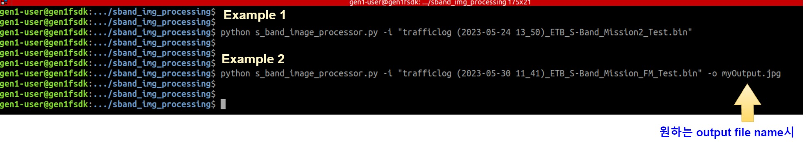

# This Program
sband radio image postprocessing python program

##	HELP COMMAND

```
python s_band_image_processor.py -h

s_band_image_processor.py  -i <input_file> -o <output_file>
```

##	PROCESS IMAGE COMMAND

```
python s_band_image_processor.py -i "trafficlog.bin"

on success
	output.jpg
```

##	PROCESS IMAGE COMMAND WITH SPECIFIED "output name"

```
python s_band_image_processor.py -i "trafficlog.bin" -o myOutput.jpg

on success
	myOutput.jpg
```

## Images
